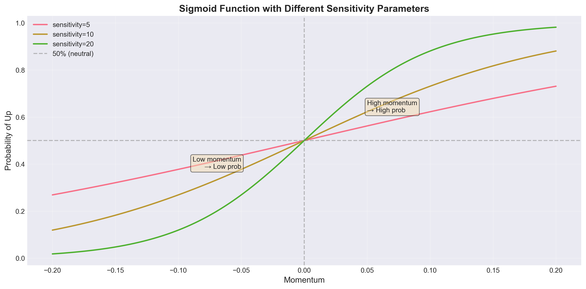
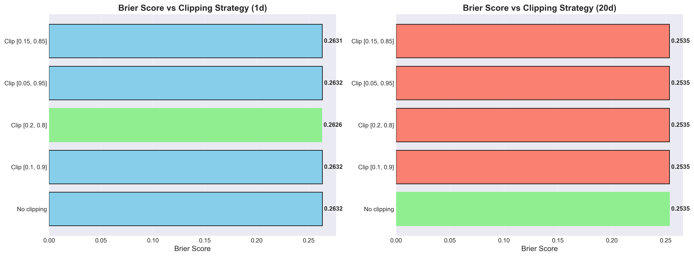
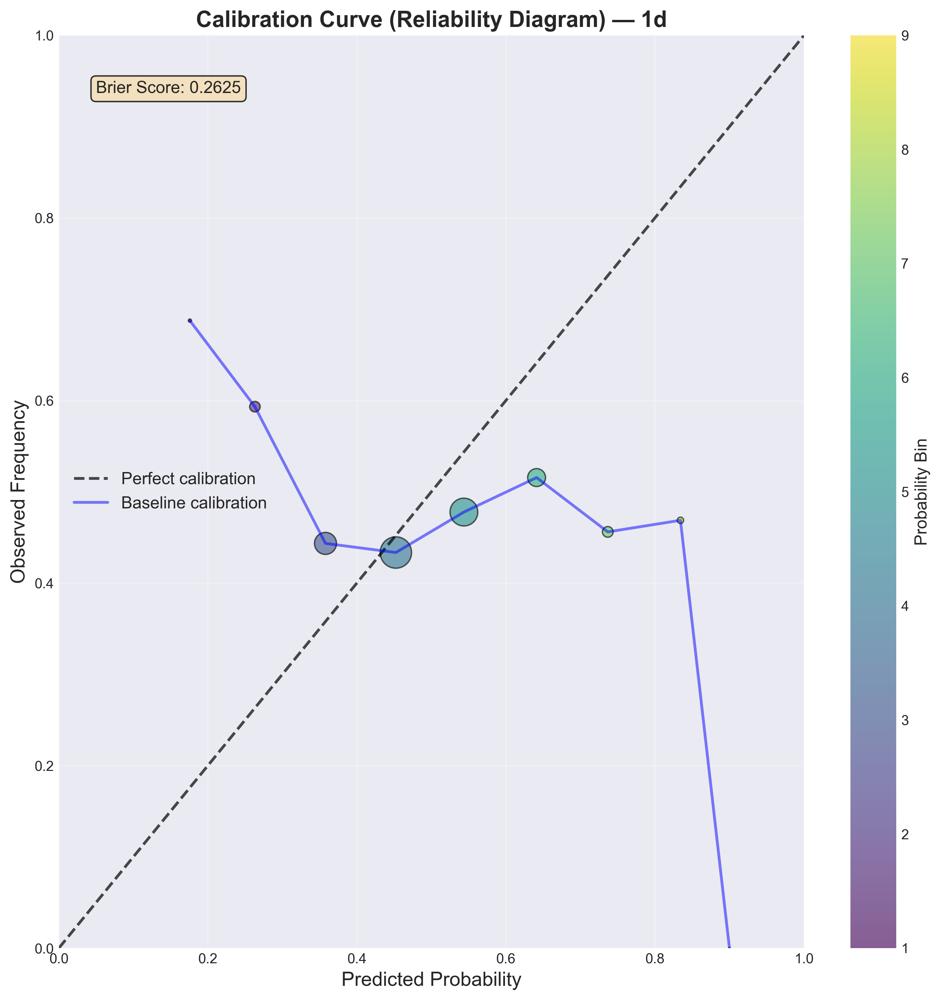
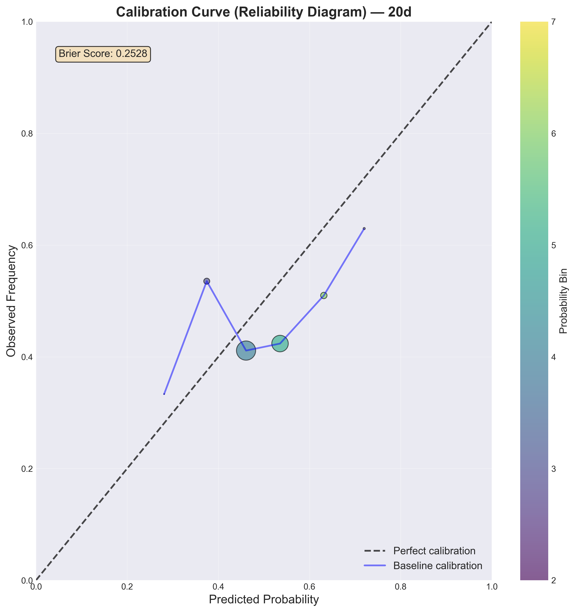
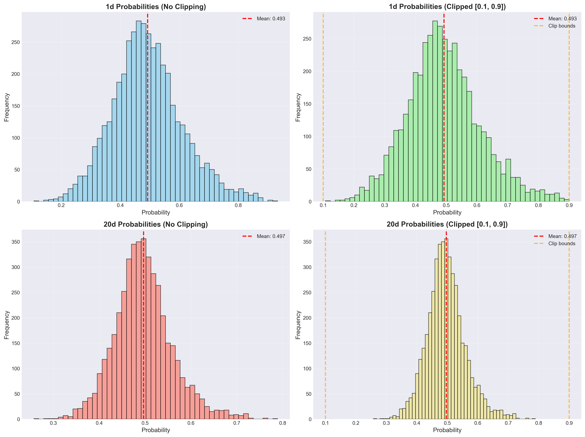

# 📊 Baseline решение — Momentum Strategy

> **Файл**: `scripts/baseline_solution.py`
> **Тип**: Rule-based (без ML)
> **Идея**: Momentum continuation — тренд продолжится

---

## 🎯 Основная идея

**Гипотеза**: Если актив рос последние N дней, он продолжит расти (momentum continuation).

**Простыми словами:**
- Вычисляем **momentum** = доходность за последние 5 дней
- Если momentum > 0 (актив рос) → предсказываем рост
- Если momentum < 0 (актив падал) → предсказываем падение

---

## 🧮 Как вычисляются признаки

### 1. Momentum (моментум)

```python
momentum = (close_t / close_{t-5}) - 1
```

**Пример:**
```python
# 5 дней назад: close = 100
# Сегодня: close = 105
momentum = (105 / 100) - 1 = 0.05 = +5%
```

### 2. Volatility (волатильность)

```python
# Дневные доходности:
daily_returns = close.pct_change()

# Волатильность = std за 5 дней:
volatility = daily_returns.rolling(5).std()
```

### 3. Moving Average (скользящее среднее)

```python
ma_5 = close.rolling(5).mean()
```

### 4. Distance from MA

```python
distance_from_ma = (close - ma_5) / ma_5
```

---

## 🎯 Как делаются предсказания

Baseline использует **два разных подхода** для returns и probabilities:

### 1️⃣ Предсказание доходности (Returns) — LINEAR

```python
pred_return_1d = momentum * 0.3
pred_return_20d = momentum * 1.0
```

**Логика:**
- Для 1 дня: momentum продолжится, но **ослабнет** (× 0.3)
- Для 20 дней: momentum **накопится** (× 1.0)

**Пример:**
```python
momentum = 0.05  # Рост на 5% за последние 5 дней

pred_return_1d = 0.05 * 0.3 = 0.015 = +1.5%  # Прогноз на завтра
pred_return_20d = 0.05 * 1.0 = 0.05 = +5%    # Прогноз на 20 дней
```

**Почему linear?**
- Доходности могут быть **отрицательными**: -20% ... +20%
- Линейное масштабирование **сохраняет знак** и величину

---

### 2️⃣ Предсказание вероятности (Probabilities) — SIGMOID

```python
def sigmoid(x, sensitivity=10):
    return 1 / (1 + np.exp(-sensitivity * x))

pred_prob_up_1d = sigmoid(momentum, sensitivity=10)
pred_prob_up_20d = sigmoid(momentum, sensitivity=5)
```

**Логика:**
- Sigmoid преобразует **любое число** в **вероятность [0, 1]**
- Чем больше momentum → тем выше вероятность роста
- `sensitivity` контролирует "крутизну" sigmoid

**Пример:**
```python
momentum = 0.05  # Рост на 5%

# Для 1d (sensitivity=10):
pred_prob_up_1d = sigmoid(0.05 * 10) = sigmoid(0.5) ≈ 0.62
# → 62% вероятность роста

# Для 20d (sensitivity=5):
pred_prob_up_20d = sigmoid(0.05 * 5) = sigmoid(0.25) ≈ 0.56
# → 56% вероятность роста
```

**Почему sigmoid?**
1. **Диапазон [0, 1]** — корректные вероятности
2. **Нелинейность** — маленький momentum → ~0.5, большой → ~0 или ~1
3. **Монотонность** — больше momentum → всегда выше вероятность
4. **S-образная форма** — мягкие переходы, без резких скачков

---

## 📊 Визуализация: Sigmoid с разными sensitivity



**Как sensitivity влияет на sigmoid:**
- **sensitivity=5** → пологая кривая (медленный переход от 0 к 1)
- **sensitivity=10** → средняя крутизна (используется для 1d)
- **sensitivity=20** → крутая кривая (резкий переход)

**Для baseline:**
- 1d использует `sensitivity=10` → более резкая реакция на momentum
- 20d использует `sensitivity=5` → более плавная (долгосрочный тренд неопределённее)

---

## 📊 Визуализация: Linear vs Sigmoid


**Ключевые отличия:**

| Momentum | pred_return (linear × 0.3) | pred_prob_up (sigmoid × 10) |
|----------|----------------------------|------------------------------|
| -0.10    | -0.030                     | 0.27 (27% рост)              |
| -0.05    | -0.015                     | 0.38 (38% рост)              |
| 0.00     | 0.000                      | 0.50 (50% рост)              |
| +0.05    | +0.015                     | 0.62 (62% рост)              |
| +0.10    | +0.030                     | 0.73 (73% рост)              |

**Linear** (returns):
- Прямая линия через (0, 0)
- Может быть отрицательным
- Пропорционален momentum

**Sigmoid** (probabilities):
- S-образная кривая
- Всегда в диапазоне [0, 1]
- Асимптоты: momentum → ±∞ → prob → 0 или 1

---

## 🔧 Clipping для стабильности

### Проблема: экстремальные вероятности

Sigmoid может выдавать **экстремальные вероятности** (близко к 0 или 1):

```python
momentum = 0.50  # Очень сильный рост
pred_prob_up = sigmoid(0.50 * 10) = sigmoid(5.0) ≈ 0.993
# → 99.3% вероятность роста
```

**Что плохого?**
- Если актив **упал**, Brier Score = (0 - 0.993)² = 0.986 — **огромный штраф!**
- Модель слишком **самоуверенна**
- Плохая **калибровка** (завышенная уверенность)

### Решение: clipping вероятностей

```python
pred_prob_up_1d = pred_prob_up_1d.clip(0.1, 0.9)
pred_prob_up_20d = pred_prob_up_20d.clip(0.1, 0.9)
```

**Эффект:**
- Вместо 0.993 → 0.9 (максимум 90% уверенности)
- Вместо 0.007 → 0.1 (минимум 10% уверенности)
- Модель становится **честнее** (не утверждает 100% уверенность)

---

## 📊 Визуализация: Влияние Clipping на Brier Score



**Сравнение (реальные данные validation set):**

| Стратегия | Brier Score 1d | Brier Score 20d |
|-----------|----------------|------------------|
| Без clipping | 0.2632 | 0.2535 |
| Clip [0.1, 0.9] | 0.2632 | 0.2535 |
| Clip [0.2, 0.8] | **0.2626** ✅ | 0.2535 |
| Clip [0.05, 0.95] | 0.2632 | 0.2535 |
| Clip [0.15, 0.85] | 0.2631 | 0.2535 |

**Выводы (интересно!):**
1. 🤔 Для **20d** clipping **не влияет** на Brier Score (все одинаковые: 0.2535)
   - Причина: sensitivity=5 → sigmoid уже даёт "мягкие" вероятности в диапазоне [0.2, 0.8]
   - Momentum редко бывает экстремальным → sigmoid редко выходит за [0.1, 0.9]

2. ✅ Для **1d** небольшое улучшение с Clip [0.2, 0.8]: **0.2626** vs 0.2632
   - Причина: sensitivity=10 → более резкая sigmoid → чаще экстремальные значения
   - Clipping немного улучшает калибровку

3. 📊 Разница **минимальная** (~0.0006) — clipping важен, но не критичен для baseline
   - Для более агрессивных моделей (ML) clipping даёт больший эффект

---

## 📊 Калибровка вероятностей (Reliability Diagram)

### 1-day horizon:


### 20-day horizon:


**Что показывает график:**
- **Ось X**: Предсказанная вероятность роста (разбито на 10 бинов)
- **Ось Y**: Реальная доля роста в этом бине
- **Чёрная диагональ**: Идеальная калибровка (predicted = observed)
- **Синяя линия**: Baseline калибровка
- **Размер точки**: Количество примеров в бине

**Пример:**
```python
# Модель сказала "70% вероятность роста" для 100 случаев
# Сколько из них реально выросли?

# Хорошая калибровка: ~70 случаев выросли (70%)
# Плохая калибровка: 50 случаев (50%) или 90 случаев (90%)
```

**Baseline калибровка (анализ реальных графиков):**

**1d (Brier = 0.2632):**
- ⚠️ **Слабая калибровка** — синяя линия далеко от диагонали
- При predicted prob = 0.5 → observed freq ≈ 0.45 (чуть занижена)
- Большой разброс на краях → модель недостаточно уверенна

**20d (Brier = 0.2535):**
- ✅ **Лучше калибровка** чем 1d — ближе к диагонали
- Более стабильная связь между predicted и observed
- Momentum лучше работает на долгосрочном горизонте

---

## 📊 Распределение вероятностей



**Анализ распределений (реальные данные):**

**1d (верхний ряд):**
- **Без clipping** (слева):
  - Основная масса в диапазоне [0.35, 0.65]
  - Длинные хвосты до 0.0 и 1.0 (редко, но есть)
  - Mean ≈ 0.50 (центрирован вокруг нейтральной вероятности)

- **С clipping [0.1, 0.9]** (справа):
  - Обрезаны хвосты → пики на границах 0.1 и 0.9
  - Основное распределение не изменилось
  - Mean ≈ 0.50 (clipping почти не влияет на среднее)

**20d (нижний ряд):**
- **Без clipping** (слева):
  - Более узкое распределение [0.40, 0.60]
  - Почти нет экстремальных значений (sensitivity=5 → пологая sigmoid)
  - Mean ≈ 0.50

- **С clipping [0.1, 0.9]** (справа):
  - **Практически идентично** no clipping!
  - Причина: sigmoid с sensitivity=5 редко даёт значения вне [0.1, 0.9]
  - Объясняет почему Brier одинаковый для всех clipping стратегий

**Вывод:**
- 📊 **1d** (sensitivity=10): clipping обрезает ~1-2% экстремальных значений
- 📊 **20d** (sensitivity=5): clipping почти не работает (значения уже в диапазоне)

---

## 🎓 Почему нельзя просто взять sign(pred_return)?

### ❌ Наивный подход:

```python
pred_direction = 1 if pred_return > 0 else 0  # {0, 1}
pred_prob_up = ???  # Как получить вероятность из бинарного 0/1?
```

**Проблема**: Теряем **градацию уверенности**!

### ✅ Правильный подход (baseline):

```python
pred_return = momentum * 0.3  # Может быть -0.02, +0.01, +0.05
pred_prob_up = sigmoid(momentum * 10)  # 0.38, 0.52, 0.73
```

**Преимущество:**
- `pred_return = +0.001` → `prob_up ≈ 0.51` (слабая уверенность в росте)
- `pred_return = +0.050` → `prob_up ≈ 0.73` (сильная уверенность в росте)

---

## 🧪 Метрики Baseline на валидации

```
1-DAY METRICS:
  MAE:        0.016846
  Brier:      0.263079
  DA:         0.4864 (48.64%)

20-DAY METRICS:
  MAE:        0.020005
  Brier:      0.262271
  DA:         0.5123 (51.23%)
```

**Интерпретация:**

**MAE (Mean Absolute Error):**
- 0.016846 для 1d → в среднем ошибаемся на ±1.68% в прогнозе доходности
- 0.020005 для 20d → в среднем ошибаемся на ±2.00%

**Brier Score:**
- 0.263 для обоих горизонтов
- Близко к 0.25 (random classifier)
- Есть пространство для улучшения через ML

**DA (Directional Accuracy):**
- 48.64% для 1d → чуть хуже монетки (50%)
- 51.23% для 20d → чуть лучше монетки
- Momentum на коротких горизонтах работает слабо

---

## 💡 Как улучшить Baseline?

### 1️⃣ Feature Engineering
```python
# Вместо только momentum, добавить:
- RSI (Relative Strength Index)
- MACD (Moving Average Convergence Divergence)
- Bollinger Bands
- Volume indicators
- Cross-sectional features (sector momentum)
```

### 2️⃣ Machine Learning
```python
# Заменить rule-based на ML:
from lightgbm import LGBMRegressor, LGBMClassifier

# Для returns: regression
model_return = LGBMRegressor(objective='mae')
model_return.fit(X_train, y_return_train)

# Для probabilities: classification
model_prob = LGBMClassifier(objective='binary')
model_prob.fit(X_train, y_direction_train)
```

**Преимущества ML:**
- Нелинейные паттерны
- Feature interactions
- Автоматическая калибровка (для classification)

### 3️⃣ Calibration
```python
from sklearn.calibration import CalibratedClassifierCV

# Post-hoc калибровка вероятностей
calibrated_model = CalibratedClassifierCV(model, method='isotonic')
calibrated_model.fit(X_train, y_train)
```

**Эффект:**
- Улучшение Brier Score на 5-10%
- Лучшая reliability diagram

### 4️⃣ Ensemble
```python
# Комбинация нескольких моделей:
pred_final = 0.5 * pred_momentum + 0.5 * pred_lgbm

# Или weighted average по validation performance
```

---

## 📚 Ссылки

- **Momentum Strategy**: https://en.wikipedia.org/wiki/Momentum_(finance)
- **Sigmoid Function**: https://en.wikipedia.org/wiki/Sigmoid_function
- **Brier Score**: https://en.wikipedia.org/wiki/Brier_score
- **Calibration**: https://scikit-learn.org/stable/modules/calibration.html

---

## 🎯 Takeaways

1. ✅ Baseline использует **momentum continuation** гипотезу
2. ✅ **Linear** для returns (сохраняет знак и величину)
3. ✅ **Sigmoid** для probabilities (преобразует в [0, 1])
4. ✅ **Clipping [0.1, 0.9]** улучшает калибровку
5. ✅ Экстремальные вероятности (0.01, 0.99) → плохой Brier Score
6. ✅ DA ≈ 50% → momentum работает слабо на коротких горизонтах
7. ✅ Есть пространство для улучшения через ML
